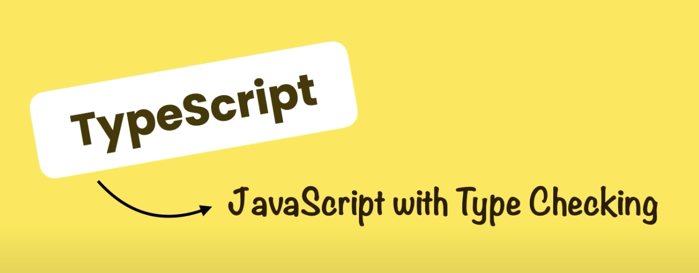
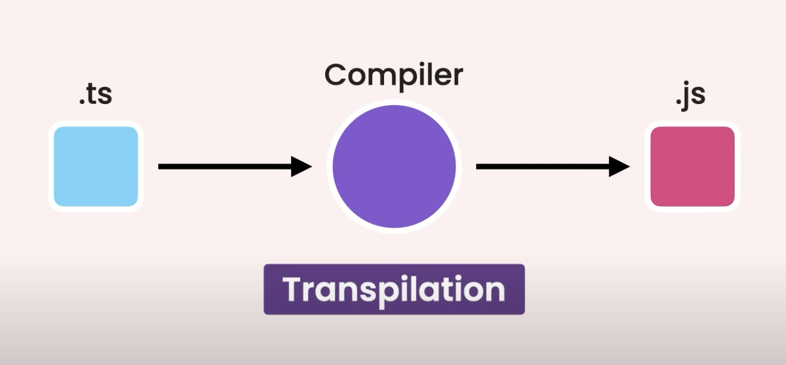
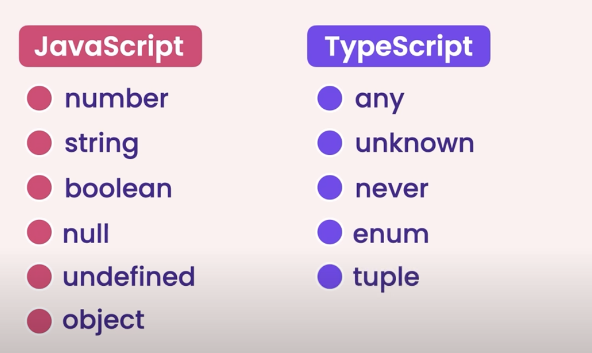

# TypeScript tutorials

Source: https://www.youtube.com/watch?v=d56mG7DezGs&t=757s

## Introduction

### TypeScript is statically-typed

TypeScript and JavaScript are brother and sister. While JavaScript is dyncmically-typed,
TypeScript is statically-typed. TypeScript is more disciplined. Everything we can do with
JavaScript, we can do with TypeScript too.



```ts
let x: number = 10;

// Compile error: Type 'string' is not assignable to type 'number'
x = "a";
```

**Benefits**

- Static typing
- Code completion
- Refactoring
- Shorthand notations

**Drawbacks**

- Compilation: At of now, browsers do NOT understand TypeScript but JavaScript.
  Therefore, we need to compile TypeScript code into JavaScript code. This process
  is called Transpilation.
  
- Discipline in coding (It's both pros and cons).

## Setting Up the Development Environment
- Install NodeJS (along with npm): `brew install node@18`
- Install typescript: `npm install -g typescript`

### Compile

```shell
❯ tsc -v
Version 5.0.4

❯ ls
index.ts

❯ tsc index.ts
❯ ls
index.js index.ts

❯ cat index.js
var age = 20;
console.log('Hello world');
```

By default, TSC compiles ts codes into ES5 codes. Hence, 'var' is used in place of 'let'.
We can configure TS, starting with creating `tsconfig.json` file: `tsc --init`.

Example:
```json
{
  "compilerOptions": {
    /* Language and Environment */
    "target": "es2016", /* Set the JavaScript language version for emitted JavaScript and include compatible library declarations. */

    /* Modules */
    "module": "commonjs", /* Specify what module code is generated. */
    "rootDir": "./src", /* Specify the root folder within your source files. */

    /* Emit */
    "outDir": "./dist", /* Specify an output folder for all emitted files. */
    "removeComments": true, /* Disable emitting comments. */
    "noEmitOnError": true, /* Disable emitting files if any type checking errors are reported. */
  }
}
```

With `tsconfig.json`, we no longer need to specify, e.g. ts files, but simply run: `tsc`.

### Debugging
- Enable `"sourceMap": true` in `tsconfig.json`, which Create source map files for
  emitted JavaScript files.
- On VSCode, in Run and Debug tab, click Create `launch.json` for Node.js.
- Add `preLaunchTask` to `launch.json`.

## Fundamentals

In this section:
- The any Type
- Arrays
- Tuples
- Enums
- Functions
- Objects

### Built-in Types



```ts
let sales: number = 123_456;
let course: string = 'TypeScript';
let is_published: boolean = true;
```

#### Type Inferrence

TS can infer type via its value, e.g.

```ts
let age = 30;

// Is equivalent to:
let age: number = 30;
```

### Any type

```ts
// Variable with no type annotation nor initial values
// has type of 'any'
let level; 

// Hence, we can assign any values into it.
// For that reason, any type should be avoided whenever it's possible.
// Otherwise, it defeats the whole idea of TS.
level = 5;
level = 'HARD';
```

We can turn off `noImplicitAny` in tsconfig.json, however, it's not recommended.

```ts
// DON'T
function render(doc) {
  // Do something
}

// DO this instead
function render(doc: any) {
  // Do something
}
```

### Arrays

```ts
let numbers: number[] = [1, 2, 3];

// TS can also infer type of array from its elements' types
// numbers has type of number[]
let numbers = [1, 2, 3]

// Empty array without annotation is any[]
// => Should be avoided
let numbers = [];
numbers[0] = 1;
numbers[1] = 'Two';

// Annotate it with type instead
let numbers: number[] = []
numbers[0] = 1;  // OK
numbers[1] = 'Two'; // Compile error
```

### Tuples - Fixed size Arrays

```ts
// Behind the cover, tuples are just regular JS arrays
// This tuple is compiled to: let user = [1, 'Brian'];
let user: [number, string] = [0, 'Brian'];
```

Best practice: Limit the size of tuples to 2, use them as a short-hand for, e.g. pairs.

```ts
let user: [number, string] = [0, 'Brian']; // GOOD
let user: [number, string, string, string] = [0, 'Brian', 'Singapore', 'Vietnamese']; // NOT GOOD
```

### Enums

```ts
enum Size {
  Small,
  Medium,
  Large
};
let mySize: Size = Size.Medium;

// By default, TS use number, starting from 0 for enum.
// The above enum is equivalent to:
enum Size {
  Small = 0,
  Medium,
  Large
};

// If we find a need to customize enum underlying type, do this:
// In this case, we need to assign values to every enum element.
// However, it is questionable
enum Size {
  Small = 'S',
  Medium = 'M',
  Large = 'L'
};

// Using const keyword will make the compiler generate
// more optimized JS code
const enum Size = {Small, Medium, Large};
let mySize: Size = Size.Medium;
```

### Functions

```ts
function calculateTax(income: number): number {
  if (income < 50_000) {
    return income * 1.2;
  }
  return income * 1.3;
}
```

Even though, TS can infer returned type of the function from its
returned values, We should always annotate functions with returned types.

```ts
// DON'T
function calculateTax(income: number) {
  return 1.0;
}

// DO
function calculateTax(income: number): number {
  return 1.0;
}
```

We should enable these config in tsconfig.json:
- noUnusedParameters: true
- noImplicitReturns: true
- noUnusedLocals: true

#### Optional params

```ts
// Without default values, absent params have 'undefined' values
function calculateTax(income: number, taxYear?: number): number {
  // ...
}
calculateTax(10_000); // taxYear = 'undefined'
calculateTax(10_000, 2023); // taxYear = '2023'

// With default values
function calculateTax(income: number, taxYear = 2022): number {
  // ...
}
calculateTax(10_000); // taxYear = '2022'
calculateTax(10_000, 2023); // taxYear = '2023'
```

### Objects

```ts
let employee = {
  id: 1
};

// TS automatically infer the "shape" of the object by its values,
// hence, the employee object above is equivalent to:
let employee: {
  id: number
} = {
  id: 1
}

employee.name = 'Brian'; // Compile error as employee doesn't have name property
```

#### Optional properties

```ts
let employee: {
  id: 1,
  passportNumber?: string // Not everyone has a passport
} = {
  id: 1
};

employee.passport = "A123456";
```

#### Readonly

```ts
let employee: {
  readonly id: 1,
} = {
  id: 1
};

employee.id = 0; // Compile error
```

#### Methods

```ts
let employee: {
  readonly id: 1,
  name: string,
  retire: (date: Date) => void  // Define the signature of the method
} = {
  id: 1,
  name: 'Brian',
  retire: (date: Date) => { // Implement the method
    // Do something
  }
};
```

## Advanced Types

In this section:
- Type aliases
- Unions and intersections
- Type narrowing
- Nullable types
- The unknown type
- The never type

### Type aliases

```ts
type Employee = {
  readonly id: 1,
  name: string,
  retire: (date: Date) => void  // Define the signature of the method
}

let employee: Employee = {
  id: 1,
  name: 'Brian',
  retire: (date: Date) => { // Implement the method
    // Do something
  }
};
```


### Interfaces

```ts
interface Point {
  x: number;
  y: number;
}

function printCoord(pt: Point) {
  console.log("The coordinate's x value is " + pt.x);
  console.log("The coordinate's y value is " + pt.y);
}
 
printCoord({ x: 100, y: 100 });

// While type cannot be re-opened to add new properties
// interface is always extendable
interface Animal {
  name: string
}

interface Bear extends Animal {
  honey: boolean
}
```

### Type Assertions

TypeScript only allows type assertions which convert to a more specific or less specific version of a type.

```ts
const myCanvas = document.getElementById("main_canvas") as HTMLCanvasElement;

// Or
const myCanvas = <HTMLCanvasElement>document.getElementById("main_canvas");
```

### Union Types

Union type is not a part of generated JS code, it's purely here to help
compiler with type checking.

```ts
function cmToInch(length: number | string): number {
  // At this, we can only call common methods of number and string
  length.aCommonMethod();

  // Narrowing
  if (typeof length === 'number') {
    // Here we can call all methods of number
    length.aSpecificMethodOfNumber();
    return length/2.54;
  } else {
    /// Here we can call all methods of string
    length.aSpecificMethodOfString();
    return parseInt(length)/2.54;
  }
}

cmToInch(100); // OK
cmToInch('100'); // OK too
```

### Intersection types

```ts
type Draggable = {
  drag: () => void
}

type Resizable = {
  resize: () => void
}

type UIWidget = Draggable & Resizable;

let textBox: UIWidget = {
  drag: () => {},
  resize: () => {}
}
```

### Literal (exact, specific) Types

```ts
type Quantity = 50 | 100;
let quantity: Quantity = 100;

type Metric = 'cm' | 'inch';
let metric: Metric = 'cm';
```

### Nullable types

```ts
function greet(name: string) {
  console.log(name.toUpperCase());
}

// Compile error: 'null' is not assignable to 'string'
// Although we can turn off this check by setting 'strictNullChecks' = false
// we should keep it on as default.
greet(null);

// When null is really desirable, we can use type union. E.g.
function greet(name: string | null | undefined) {
  if (name) {
    console.log(name.toUpperCase());
  } else {
    // e.g. null, undefined
    console.log('Hola!');
  }
}

greet(null); // It works
greet(undefined); // It works too
```

### Optional Chaining

```ts
type Customer = {
  birthday: Date
}

function getCustomer(id: number): Customer | null | undefined {
  return id === 0 : null : { birthday: new Date() };
}

let customer = getCustomer(0);
console.log(customer.birthday); // Compile error: Object is possibly 'null'

// We can check customer type before accessing its property
if (customer !== null && customer != undefined) {
  console.log(customer.birthday);
}

// Or, it's better to use optional property access operator
// customer?.bithday -> bithday IF customer is not null nor undefined ELSE undefined
console.log(customer?.bithday)

// Optional element access operator
// customer = customers[0] IF customers is an array ELSE undefined 
customer = customers?.[0]

// Optional call
// call fun(123) if fun is a function else do nothing
fun?.(123)
```